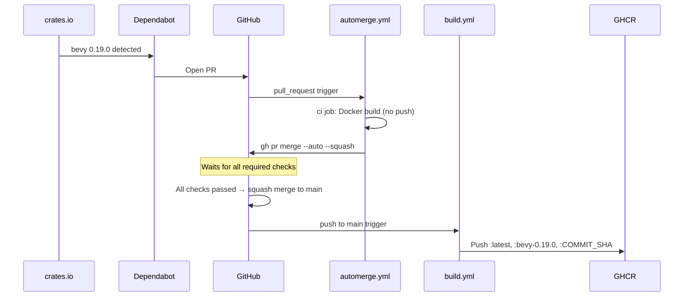
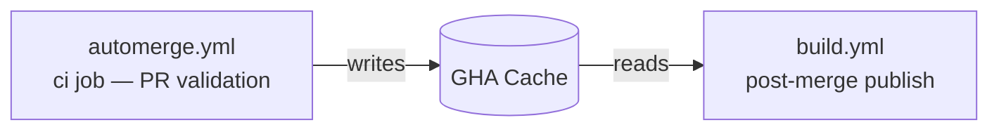

# Bevy Version Auto-Update Flow

bevy-docker automatically updates and publishes its Docker image whenever a new Bevy version is released — no manual intervention required.
This document explains how the system works, component by component.

---

## Overview



## Components

### 1. Dependabot (`.github/dependabot.yml`)

```yaml
updates:
  - package-ecosystem: cargo
    directory: /
    schedule:
      interval: daily
    open-pull-requests-limit: 1
```

- Checks crates.io **once a day** for new versions of `bevy` listed in `Cargo.toml`.
- When a new version is found, opens a PR that updates `Cargo.toml` and `Cargo.lock`.
- `open-pull-requests-limit: 1` ensures at most one open PR at a time.

### 2. Validation and Auto-merge (`.github/workflows/automerge.yml`)

This workflow triggers on every `pull_request` event targeting `main` (opened, synchronize, reopened).
It consists of two jobs, both of which only act on Dependabot PRs.

#### `ci` job (validation)

- Only runs when `github.actor == 'dependabot[bot]'` — other PRs are unaffected.
- Validates by **building the Docker image itself** using the following steps:

```yaml
- uses: actions/checkout@v6
- name: Set up Docker Buildx
  uses: docker/setup-buildx-action@v3
- name: Build Docker image (validation only, no push)
  uses: docker/build-push-action@v6
  with:
    context: .
    push: false
    cache-from: type=gha
    cache-to: type=gha,mode=max
```

  Running `cargo check` directly on a plain ubuntu-latest runner would fail because
  Bevy requires many Linux system packages (`libx11-dev`, `libasound2-dev`, etc.).
  The Docker build installs all required packages as part of the Dockerfile,
  making it an accurate and self-contained validation.
- Uses GHA cache (`type=gha`) to speed up the build.
  This cache is reused by the subsequent `build.yml` run after the PR merges.

#### `automerge` job (merging)

- Runs only after the `ci` job succeeds (`needs: ci`).
  Because the `ci` job has `if: github.actor == 'dependabot[bot]'`, non-Dependabot PRs
  cause `ci` to be skipped, which in turn skips `automerge` as well.
- Requires `contents: write` and `pull-requests: write` permissions.
- `--auto` enables GitHub's auto-merge feature. Because `automerge` runs only after `ci`
  has already succeeded, the `ci` check is already satisfied when auto-merge is enabled.
  The merge will be held if any other required status checks are still pending.
- `--squash` squashes the PR commits into a single commit on main.

> **Prerequisite**
> In your GitHub repository, go to Settings → Branches → Branch protection rules
> and add the `ci` job as a required status check.
> Without this, `--auto` will merge immediately without waiting for any checks.

### 3. Image Build and Publish (`.github/workflows/build.yml`)

Triggered on push to main when `Dockerfile`, `Cargo.toml`, or `Cargo.lock` change.

#### Image tags

| Tag | Description |
|-----|-------------|
| `:latest` | Always points to the most recent Bevy version |
| `:bevy-X.Y.Z` | Pinned to a specific Bevy version (e.g. `:bevy-0.18.1`) |
| `:COMMIT_SHA` | Pinned to a specific build |

The Bevy version is extracted from `Cargo.toml` with:

```bash
sed -n 's/^bevy = "\(.*\)"/\1/p' Cargo.toml
```

The Rust version is intentionally excluded from tags. Rust is an internal
implementation detail; the only version contract that consumers need to care
about is the Bevy version.

#### Cache handoff between workflows



Because most Docker layers are already cached from the PR validation build,
the final image publish after the merge completes quickly.

## Impact on Consuming Projects

Projects using `:latest` will automatically pick up the new Bevy version on their next CI run.

To pin to a specific version, use the `:bevy-X.Y.Z` tag:

```yaml
jobs:
  ci:
    runs-on: ubuntu-latest
    container:
      image: ghcr.io/ankd-k/bevy-docker:bevy-0.18.1  # pinned
    steps:
      - uses: actions/checkout@v6
      - run: cargo check
```
